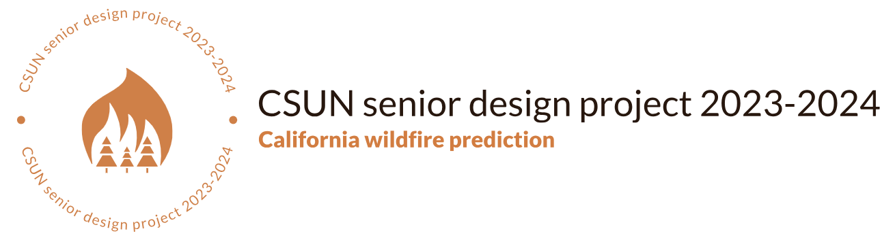

# California Wildfire Prediction


> A machine learning project for predicting wildfires in California using data-driven approaches.

## Table of Contents

- [Description](#description)
- [Key Features](#key-features)
- [Team Members](#team-members)
- [Installation](#installation)
- [Usage](#usage)
- [Data Sources](#data-sources)
- [Project Structure](#project-structure)
- [Contributing](#contributing)
- [License](#license)

## Description

The California Wildfire Prediction project is aimed at mitigating the increasing wildfire threat in California by leveraging data-driven approaches. This repository contains the code and resources for building predictive models, processing data, and visualizing results. The project employs machine learning techniques, including deep learning, to forecast wildfire risks based on historical data.

## Built With
- 
- 
- 
- 

## Key Features

- data collection from various sources.
- Data preprocessing, including cleaning and feature engineering.
- Machine learning models for wildfire risk prediction.
- Interactive visualizations and user-friendly dashboards.
- Continuous model evaluation and improvement.

## Team Members

Meet the team members who have contributed to this project:

- [Farid Koushaneh](https://github.com/faridko26)
- [Alondra Sanchez](https://github.com/Whimss)
- [Luis Padilla](https://github.com/luis-pad)
- [Matthew Bellman]()
- [Edwin Rivera]()

## Installation

To set up the project on your local machine, follow these steps:

1. Clone the repository:

   ```bash
   git clone https://github.com/faridko26/California-Wildfire-Prediction.git

